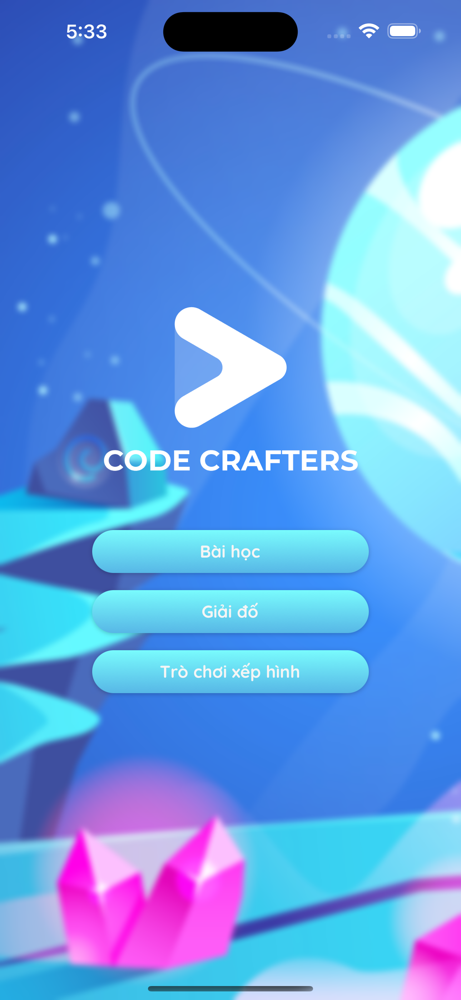

# CodeCrafters


## Demo App

## Table of Contents
- [Table of Contents](#table-of-contents)
  - [About](#about)
  - [Features](#features)
  - [Screenshots](#screenshots)
  - [Getting Started](#getting-started)
    - [Prerequisites](#prerequisites)
    - [Installation](#installation)

## About

The CodeCrafters app makes it easy for children to grasp programming concepts and ignites their passion for technology. The app offers video lectures, puzzle-solving games, and jigsaw activities, all centered around programming topics. The app's goal is to impart diverse programming knowledge and encourage children to develop creative thinking, providing them with the ability to create intelligent and unique projects according to their interests.

## Features
- Lessons
- Puzzle
- Quiz

## Screenshots

<p float='left'>


</p>


## Getting Started

### Prerequisites

- Node.Js: https://nodejs.org/en
- Expo: https://docs.expo.dev/get-started/installation/
- Yarn: https://classic.yarnpkg.com/lang/en/docs/install/#mac-stable

### Installation

- Clone the repository to your local machine
- Install dependencies using npm or yarn
- Run the app using `yarn start` or another suitable command

```bash
git clone https://github.com/akiyamahaa/expo-tech-app.git
cd expo-tech-app
yarn
yarn start
